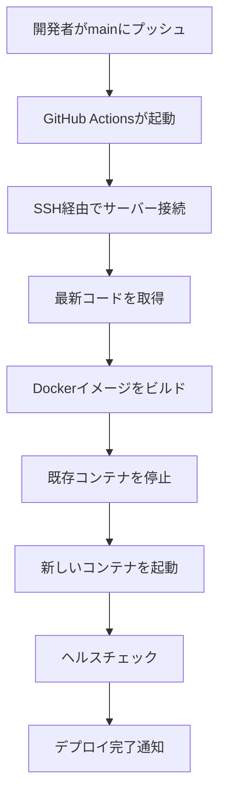
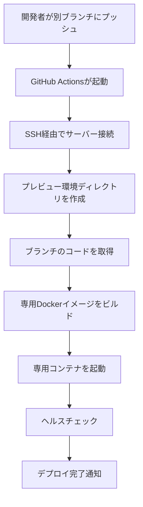

# デプロイシステム概要

このドキュメントでは、ConoHa VPSへの自動デプロイシステムの構成と、作成されたファイルについて説明します。

## 作成されたファイル

### 1. Dockerファイル（本番環境用）

#### `/backend/Dockerfile`
本番環境用のバックエンドDockerfile。マルチステージビルドを使用して、最適化されたバイナリを生成します。

**特徴:**
- ビルドステージと実行ステージを分離
- CGO無効化による完全な静的バイナリの生成
- Alpine Linuxベースで軽量なイメージサイズ

#### `/frontend/Dockerfile`
本番環境用のフロントエンドDockerfile。Viteでビルドし、Nginxで配信します。

**特徴:**
- マルチステージビルドによる最適化
- Nginxによる静的ファイル配信
- SPA対応のルーティング設定

#### `/frontend/nginx.conf`
NginxのWebサーバー設定ファイル。

**機能:**
- SPAのルーティング対応
- Gzip圧縮の有効化
- 静的ファイルのキャッシュ設定
- セキュリティヘッダーの追加

---

### 2. Docker Compose設定

#### `/docker-compose.production.yml`
本番環境用のDocker Compose設定ファイル。

**サービス構成:**
- `db`: PostgreSQL 18データベース
- `backend`: Goバックエンドアプリケーション
- `frontend`: React + Nginxフロントエンド
- `caddy`: リバースプロキシとSSL証明書管理

**特徴:**
- 環境変数による設定管理
- ヘルスチェック機能
- 自動再起動設定
- ボリュームによるデータ永続化

---

### 3. リバースプロキシ設定

#### `/Caddyfile`
Caddyのリバースプロキシ設定ファイル。

**機能:**
- 自動SSL証明書取得（Let's Encrypt）
- バックエンドAPIへのプロキシ
- WebSocketプロキシ
- セキュリティヘッダーの追加
- Gzip圧縮
- アクセスログ

---

### 4. 環境変数設定

#### `/.env.production.example`
本番環境用の環境変数テンプレートファイル。

**設定項目:**
- データベース接続情報
- JWT認証シークレット
- CORS設定
- Wasabi S3設定
- Caddy設定（ドメイン、メールアドレス）

---

### 5. CI/CDパイプライン

#### `/.github/workflows/deploy.yml`
GitHub Actionsの自動デプロイワークフロー。

**機能:**
- mainブランチへのプッシュで本番環境へ自動デプロイ
- 他のブランチへのプッシュでプレビュー環境を自動作成
- SSH経由でのサーバー接続
- Dockerコンテナの自動ビルド・デプロイ
- デプロイ結果の通知

**ワークフローの流れ:**
```
1. リポジトリのチェックアウト
2. デプロイ環境の判定（本番 or プレビュー）
3. SSH秘密鍵の設定
4. サーバーへのSSH接続
5. 最新コードの取得
6. Dockerイメージのビルド
7. コンテナの再起動
8. デプロイ完了通知
```

---

### 6. デプロイスクリプト

#### `/scripts/deploy.sh`
サーバー上で実行するデプロイスクリプト。

**機能:**
- 本番環境とプレビュー環境の切り替え
- 最新コードの自動取得
- Dockerコンテナの自動ビルド・起動
- ヘルスチェック
- エラーハンドリング

**使用方法:**
```bash
# 本番環境へデプロイ
./scripts/deploy.sh production main

# プレビュー環境へデプロイ
./scripts/deploy.sh preview feature/new-feature
```

#### `/scripts/cleanup-preview.sh`
プレビュー環境をクリーンアップするスクリプト。

**機能:**
- Dockerコンテナの停止・削除
- 未使用イメージの削除
- ディレクトリの削除

**使用方法:**
```bash
./scripts/cleanup-preview.sh feature/new-feature
```

---

### 7. ドキュメント

#### `/docs/deployment.md`
ConoHa VPSへのデプロイ手順書。

**内容:**
- 必要なもの
- ConoHa VPSの初期設定
- サーバーの準備
- GitHub Actionsの設定
- 本番環境のデプロイ
- プレビュー環境のデプロイ
- トラブルシューティング
- セキュリティ設定
- バックアップ設定
- パフォーマンス最適化

#### `/docs/deployment-checklist.md`
デプロイ作業のチェックリスト。

**内容:**
- 事前準備
- ConoHa VPSの設定
- サーバーの初期設定
- GitHub Actionsの設定
- セキュリティ設定
- バックアップ設定
- パフォーマンス最適化
- 定期メンテナンス計画

#### `/docs/deployment-summary.md`（このファイル）
デプロイシステムの概要説明。

---

### 8. その他の更新

#### `/README.md`
プロジェクトのREADMEにデプロイセクションを追加。

#### `/.gitignore`
本番環境の環境変数ファイルを除外設定に追加。

---

## システムアーキテクチャ

### 本番環境

```
インターネット
    ↓
Caddy（ポート80/443）
    ├─ /api/* → Backend（ポート8080）
    ├─ /ws → Backend WebSocket
    └─ /* → Frontend Nginx（ポート80）
         ↓
    PostgreSQL（ポート5432）
```

### プレビュー環境

```
インターネット
    ↓
Caddy（動的ポート）
    ├─ /api/* → Backend
    ├─ /ws → Backend WebSocket
    └─ /* → Frontend Nginx
         ↓
    PostgreSQL（専用コンテナ）
```

---

## デプロイフロー

### 本番環境へのデプロイ



### プレビュー環境の作成



---

## 環境変数の管理

### 開発環境
- ファイル: `backend/.env`
- 用途: ローカル開発用
- 管理: Gitで管理しない（.gitignoreに追加済み）

### 本番環境
- ファイル: `.env.production`
- 用途: 本番サーバー用
- 管理: サーバー上で直接管理、Gitで管理しない

### プレビュー環境
- ファイル: `.env.preview`
- 用途: プレビューサーバー用
- 管理: サーバー上で直接管理、Gitで管理しない

---

## セキュリティ考慮事項

### 1. SSL/TLS証明書
- Caddyが自動的にLet's Encryptから証明書を取得
- 証明書の自動更新
- HTTPSへの自動リダイレクト

### 2. 環境変数の保護
- 本番環境の環境変数はGitで管理しない
- GitHub Secretsを使用して機密情報を保護
- SSH秘密鍵の厳格な権限設定

### 3. ファイアウォール
- 必要最小限のポートのみ開放（22, 80, 443）
- UFWによるファイアウォール設定

### 4. SSH接続
- 公開鍵認証の使用
- rootログインの無効化
- パスワード認証の無効化

### 5. セキュリティヘッダー
- X-Frame-Options
- X-Content-Type-Options
- X-XSS-Protection
- Strict-Transport-Security

---

## 運用のベストプラクティス

### 1. デプロイ前の確認
- ローカル環境でのテスト実施
- プレビュー環境での動作確認
- データベースマイグレーションの確認

### 2. デプロイ後の確認
- アプリケーションログの確認
- エラーログの監視
- パフォーマンスメトリクスの確認

### 3. ロールバック手順
```bash
# 前のバージョンに戻す
cd /opt/chat
git log --oneline -10  # コミット履歴を確認
git reset --hard <前のコミットハッシュ>
docker compose -f docker-compose.production.yml down
docker compose -f docker-compose.production.yml up -d --build
```

### 4. バックアップ
- 毎日午前3時に自動バックアップ
- 30日以上前のバックアップは自動削除
- 定期的なリストアテストの実施

### 5. 監視
- アプリケーションログの監視
- リソース使用状況の監視
- エラー率の監視
- レスポンスタイムの監視

---

## トラブルシューティングクイックガイド

### デプロイが失敗する
1. GitHub Actionsのログを確認
2. サーバーのDockerログを確認: `docker compose -f docker-compose.production.yml logs`
3. 環境変数の設定を確認
4. ディスク容量を確認: `df -h`

### アプリケーションが起動しない
1. コンテナの状態を確認: `docker compose -f docker-compose.production.yml ps`
2. 個別のサービスログを確認: `docker compose -f docker-compose.production.yml logs backend`
3. データベース接続を確認
4. 環境変数の設定を確認

### SSL証明書が取得できない
1. DNSの設定を確認
2. ポート80と443が開いているか確認
3. Caddyのログを確認: `docker compose -f docker-compose.production.yml logs caddy`
4. ドメインの解決を確認: `nslookup your-domain.com`

### パフォーマンスが悪い
1. リソース使用状況を確認: `docker stats`
2. システムリソースを確認: `htop`
3. データベースのインデックスを確認
4. 不要なプレビュー環境を削除

---

## 今後の改善案

### 1. 監視システムの導入
- Prometheus + Grafanaの導入
- アラート通知の設定
- メトリクスダッシュボードの作成

### 2. ログ管理の強化
- ELKスタック（Elasticsearch, Logstash, Kibana）の導入
- ログの一元管理
- ログの可視化

### 3. 負荷分散
- 複数のバックエンドインスタンスの起動
- ロードバランサーの導入
- オートスケーリングの設定

### 4. CI/CDの強化
- 自動テストの実行
- コードカバレッジの計測
- セキュリティスキャン
- パフォーマンステスト

### 5. Blue-Greenデプロイ
- ダウンタイムゼロのデプロイ
- ロールバックの高速化

---

## まとめ

このデプロイシステムは、以下の機能を提供します：

✅ **自動デプロイ**: GitHub Actionsによる自動デプロイ
✅ **プレビュー環境**: ブランチごとの独立した環境
✅ **SSL証明書**: Caddyによる自動取得・更新
✅ **セキュリティ**: 適切な認証とファイアウォール設定
✅ **バックアップ**: 自動バックアップとリストア手順
✅ **監視**: ログとメトリクスの確認方法

詳細な手順については、[デプロイ手順書](./deployment.md)を参照してください。
