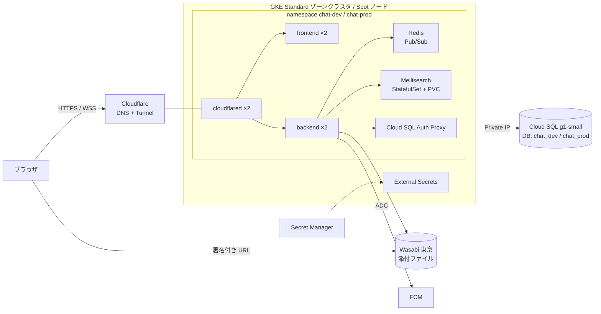

# インフラの構成と初回セットアップ

dev と prod を 1 つの GCP プロジェクト・1 つの GKE クラスタに namespace で分けて載せる。Terraform は `infra/terraform/`、Kubernetes のマニフェストは `infra/k8s/` にある。



| 部分 | 置き場所 | 内容 |
| --- | --- | --- |
| 共有 | `infra/terraform/shared` | API の有効化、VPC と Cloud NAT、GKE（`asia-northeast1-b`、Spot の e2-medium を 2〜4 台）、Cloud SQL のインスタンス、Artifact Registry、GitHub Actions 用の Workload Identity Federation のプール |
| 環境ごと | `infra/terraform/envs/{dev,prod}`（中身は `modules/environment`） | DB とユーザー、backend の GSA と Workload Identity、Secret Manager のシークレット（ID は `<環境>-<変数名>`）、デプロイ用の GSA、Cloudflare Tunnel と DNS レコード、Wasabi のバケット |
| マニフェスト | `infra/k8s/base` と `overlays/{dev,prod}` | backend・frontend・cloudflared は 2 レプリカ、Redis と Meilisearch は 1 つ。環境ごとの値は `overlays/<環境>/params.yaml` と `components/gke`（Cloud SQL Auth Proxy・External Secrets・Workload Identity も持つ）で埋め込む |

知っておくこと:

- **backend は複数レプリカで動く**。WebSocket の配信・チャンネルの閲覧者一覧・Webhook のレート制限は Redis で共有する。Redis は永続化しないが、落ちても閲覧者は 30 秒ごとの延長で戻り、配信は再接続で続く
- **Spot ノード**は予告なく回収される。backend は SIGTERM で readiness を落とし、WebSocket を 1001 で閉じてから止まり、クライアントは他のレプリカへつなぎ直して取りこぼしを取り直す。2 台が同時に回収されると全体が止まる
- **Cloud SQL は dev と prod で共有**する（`max_connections` は 50）。backend は 1 レプリカあたり最大 10 接続（`DB_MAX_OPEN_CONNS`）。PITR と削除保護はインスタンス単位なので dev にも効く。prod の DB とユーザーは `terraform destroy` しても消えない（`deletion_policy = ABANDON`）
- **検索インデックス**は DB から作り直せる。Meilisearch のデータが消えても、backend は起動時にインデックスが空なら全件を登録し直す（`kubectl -n chat-dev rollout restart deployment/backend`）

## 初回セットアップ

前提: `gcloud`・`terraform`（1.11 以上）・`kubectl`・`kustomize`・`helm`・`gh` が使えること。以下の `PROJECT_ID` などは適宜置き換える。

### 1. プロジェクトと state バケット

```sh
gcloud auth login
gcloud auth application-default login
gcloud config set project PROJECT_ID
gcloud services enable storage.googleapis.com cloudresourcemanager.googleapis.com serviceusage.googleapis.com

gcloud storage buckets create gs://PROJECT_ID-tfstate --location=asia-northeast1 --uniform-bucket-level-access
gcloud storage buckets update gs://PROJECT_ID-tfstate --versioning
```

### 2. Cloudflare と Wasabi の準備

- 使うドメインを Cloudflare（Free プラン）に追加し、レジストラのネームサーバーを Cloudflare に向ける。アカウント ID とゾーン ID を控える
- Cloudflare の API トークンを「Account → Cloudflare Tunnel: 編集」「Zone → DNS: 編集」の権限で作る
- Wasabi で Terraform 用のアクセスキー（バケットを作れる権限）を作る
- アプリ用には、環境ごとのバケットだけを読み書きできるポリシーを付けたサブユーザーを作り、アクセスキーを発行しておく（手順 4 で Secret Manager に入れる）

Wasabi は 1TB 分の最低料金がかかり、削除したデータも 90 日分は課金される。契約前に最新の条件を確認する。

### 3. Terraform

shared を先に作り、次に各環境を作る。

```sh
cd infra/terraform/shared
cp terraform.tfvars.example terraform.tfvars   # project_id を書く
terraform init -backend-config="bucket=PROJECT_ID-tfstate"
terraform apply
terraform output

export CLOUDFLARE_API_TOKEN=...          # 手順 2 のトークン
export AWS_ACCESS_KEY_ID=...             # 手順 2 の Wasabi の Terraform 用キー
export AWS_SECRET_ACCESS_KEY=...
for env in dev prod; do
  cd ../envs/$env
  cp terraform.tfvars.example terraform.tfvars   # ドメイン、バケット名、Cloudflare の ID を書く
  terraform init -backend-config="bucket=PROJECT_ID-tfstate"
  terraform apply
  terraform output
done
```

Cloudflare Tunnel は Terraform が作り、`frontend_domain` と `api_domain` の CNAME も Cloudflare に登録される。LB・静的 IP・証明書は不要。

### 4. Wasabi のキーを Secret Manager に入れる

Terraform は箱だけを作るので、手順 2 のサブユーザーのキーを環境ごとに登録する。

```sh
for env in dev prod; do
  printf '%s' 'ACCESS_KEY_ID' | gcloud secrets versions add "$env-WASABI_ACCESS_KEY_ID" --data-file=-
  printf '%s' 'SECRET_ACCESS_KEY' | gcloud secrets versions add "$env-WASABI_SECRET_ACCESS_KEY" --data-file=-
done
```

### 5. External Secrets Operator

クラスタに 1 つだけ入れる。requests などは `infra/k8s/external-secrets/values.yaml` で管理する。

```sh
gcloud container clusters get-credentials chat --location=asia-northeast1-b
helm repo add external-secrets https://charts.external-secrets.io
helm upgrade --install external-secrets external-secrets/external-secrets \
  --namespace external-secrets --create-namespace \
  -f infra/k8s/external-secrets/values.yaml
```

### 6. マニフェストに値を反映

`infra/k8s/overlays/<環境>/` の 2 ファイルを `terraform output` の値で書き換えてコミットする。

- `params.yaml`: `PROJECT_ID`、`CLUSTER_NAME`・`CLUSTER_LOCATION`（shared の `gke_cluster_*`）、`BACKEND_SERVICE_ACCOUNT`（envs の `backend_service_account_email`）、`CLOUDSQL_CONNECTION_NAME`（shared の `cloudsql_connection_name`）
- `kustomization.yaml`: `images` の `newName`（shared の `artifact_registry_url` + `/backend`・`/frontend`）、`backend-env` の `CORS_ALLOWED_ORIGINS`（`https://FRONTEND_DOMAIN`）・`WASABI_BUCKET`（envs の `attachments_bucket`）・`GOOGLE_OAUTH_CLIENT_ID`・`FIREBASE_PROJECT_ID`・`PASSWORD_AUTH_ENABLED`

`kustomize build infra/k8s/overlays/dev` で展開結果を確認できる。

### 7. Google ログインと Firebase

- 「API とサービス → 認証情報」で OAuth クライアント ID（ウェブアプリ）を作り、承認済みの JavaScript 生成元に dev と prod の両方の `https://FRONTEND_DOMAIN` を登録する
- Firebase コンソールでこのプロジェクトに Firebase を追加し、ウェブアプリを登録して `apiKey` などと VAPID キーを控える。dev と prod は同じ Firebase プロジェクトを使う（通知先のトークンは環境ごとの DB に保存されるので混ざらない）。backend は Workload Identity の ADC で FCM に送る

### 8. GitHub の Environment

リポジトリの Settings → Environments で `dev` と `prod` を作る。`prod` には「Required reviewers」を付け、承認がないとデプロイが動かないようにする。それぞれに次の変数（Variables）を登録する。

| 変数 | 値 |
| --- | --- |
| `GCP_WORKLOAD_IDENTITY_PROVIDER` | shared の `workload_identity_provider` |
| `GCP_DEPLOY_SERVICE_ACCOUNT` | envs の `deployer_service_account_email` |
| `GCP_REGION` | `asia-northeast1` |
| `GKE_CLUSTER` | shared の `gke_cluster_name` |
| `GKE_LOCATION` | shared の `gke_cluster_location` |
| `ARTIFACT_REGISTRY` | shared の `artifact_registry_url` |
| `API_DOMAIN` | その環境の `api_domain` |
| `VITE_GOOGLE_OAUTH_CLIENT_ID` | OAuth クライアント ID |
| `VITE_FIREBASE_API_KEY` / `VITE_FIREBASE_PROJECT_ID` / `VITE_FIREBASE_MESSAGING_SENDER_ID` / `VITE_FIREBASE_APP_ID` / `VITE_FIREBASE_VAPID_KEY` | Firebase のウェブアプリ設定 |

### 9. 初回デプロイ

初回は両方の ref を指定する（クラスタに既存のイメージがないため）。

```sh
gh workflow run deploy.yml -R newt239/chat -f environment=dev -f backend_ref=main -f frontend_ref=main
```

`ENV=production` では自動シードしないため、テスト用データが必要なら `kubectl -n chat-dev exec deploy/backend -c backend -- ./seed` を実行する。

### 10. 動作確認

dev で次を確かめてから prod を作る。

- [ ] ログイン（Google とパスワード）
- [ ] 投稿が backend のレプリカをまたいで届く（2 つのブラウザで、`kubectl -n chat-dev logs` で別々の Pod につながっていることを見る）
- [ ] 閲覧者一覧、既読と未読数
- [ ] 添付ファイルのアップロードとダウンロード（Wasabi への署名付き URL）
- [ ] 検索（Meilisearch の Pod を消して PVC ごと作り直したあと、backend の再起動で検索できるようになる）
- [ ] 予約投稿が一度だけ送られる
- [ ] プッシュ通知
- [ ] Webhook（連続で送ると全レプリカ合わせて毎秒 1 回・瞬間 10 回で 429 になる）
- [ ] `kubectl -n chat-dev delete pod <backend の Pod>` で、クライアントがつなぎ直して配信が続く

### 11. 旧構成の片付け

Autopilot の構成を作っていた場合は、動作確認のあとで旧 Autopilot クラスタ、外部 HTTP(S) LB、静的 IP、managed 証明書、GCS の添付ファイル用バケット、HMAC キーとそのサービスアカウント、旧シークレット（接頭辞のない `DATABASE_URL` など）を削除する。旧 `envs/dev` の state は `envs/dev` の prefix に残っているので、新しい `envs/dev` を apply する前に `gsutil rm -r gs://PROJECT_ID-tfstate/envs/dev` で消すか、旧構成を `terraform destroy` しておく。

## デプロイ

GitHub Actions の「Deploy」（`.github/workflows/deploy.yml`）で行う。ref を空にした方はクラスタで動いているイメージをそのまま使う。

```sh
# dev の backend だけ feat/foo に差し替える
gh workflow run deploy.yml -R newt239/chat -f environment=dev -f backend_ref=feat/foo

# dev で動いている版を prod に出す（backend は同じイメージ、frontend は同じコミットを prod の URL でビルドし直す）
gh workflow run deploy.yml -R newt239/chat -f environment=prod -f promote_from_dev=true
```

## CI で terraform plan する（任意）

`terraform.yml` の `plan` ジョブはリポジトリ変数 `GCP_TERRAFORM_SERVICE_ACCOUNT` があるときだけ動き、`shared`・`envs/dev`・`envs/prod` を plan する。plan 用の GSA を作って閲覧権限と state バケット・シークレットの読み取り権限を与え、GitHub のリポジトリから借用できるようにする。

```sh
gcloud iam service-accounts create chat-terraform-plan
SA=chat-terraform-plan@PROJECT_ID.iam.gserviceaccount.com
for role in roles/viewer roles/iam.securityReviewer roles/secretmanager.secretAccessor; do
  gcloud projects add-iam-policy-binding PROJECT_ID --member="serviceAccount:$SA" --role="$role"
done
gcloud storage buckets add-iam-policy-binding gs://PROJECT_ID-tfstate --member="serviceAccount:$SA" --role=roles/storage.objectViewer
gcloud iam service-accounts add-iam-policy-binding "$SA" --role=roles/iam.workloadIdentityUser \
  --member="principalSet://iam.googleapis.com/$(terraform -chdir=infra/terraform/shared output -raw github_pool_name)/attribute.repository/newt239/chat"
```

リポジトリに次を登録する。

- 変数: `GCP_WORKLOAD_IDENTITY_PROVIDER`、`GCP_TERRAFORM_SERVICE_ACCOUNT`、`TF_STATE_BUCKET`、`TFVARS_SHARED`・`TFVARS_DEV`・`TFVARS_PROD`（各ディレクトリの `terraform.tfvars` の中身）
- シークレット: `CLOUDFLARE_API_TOKEN`、`WASABI_TERRAFORM_ACCESS_KEY_ID`、`WASABI_TERRAFORM_SECRET_ACCESS_KEY`（読み取りだけのキーでよい）。ないときは envs の plan を省く
